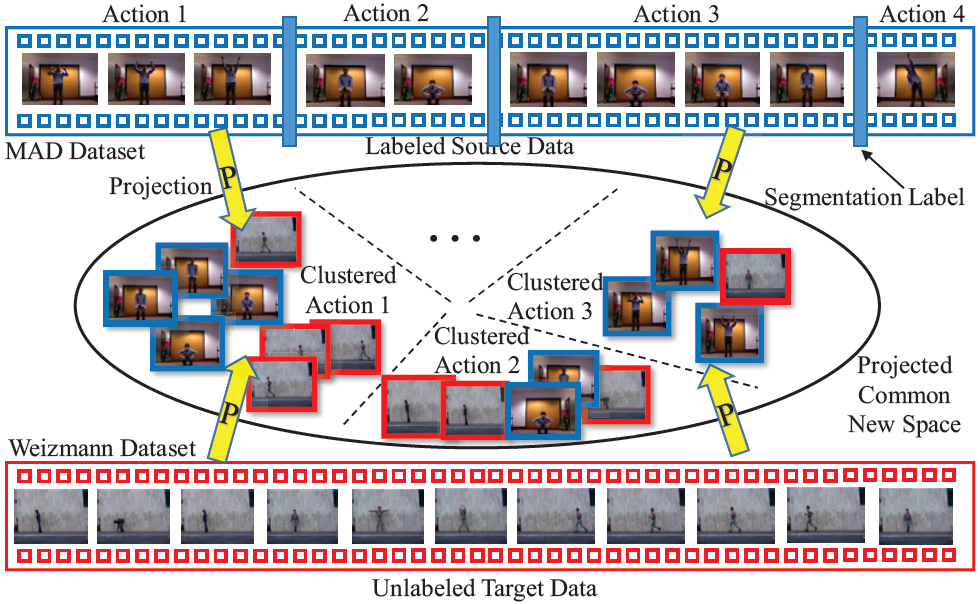

# Learning Transferable Subspace for Human Motion Segmentation
This repository contains code for our AAAI 18 paper: [Learning Transferable Subspace for Human Motion Segmentation](https://github.com/wanglichenxj/TSS_Action_Segmentation/blob/master/Presentation/TSS_Action_Segmentation_AAAI19_Lichen.pdf) (TSS). TSS is a novel approach for human action segmentation in time space. It utilizes well labeled source video to improve the target video segmentation performance.

<div align="center">
    
</div>

Temporal data clustering is a challenging task. Existing methods usually explore data self-representation strategy, which may hinder the clustering performance in insufficient or corrupted data scenarios. In real-world applications, we are easily accessible to a large number of related labeled data. To this end, we propose a novel transferable subspace clustering approach by exploring useful information from relevant source data to enhance clustering performance in target temporal data. We manage to transform the original data into a shared low-dimensional and distinctive feature space by jointly seeking an effective domain-invariant projection. In this way, the well-labeled source knowledge can help obtain a more discriminative target representation. Moreover, a graph regularizer is designed to incorporate temporal information to preserve more sequence knowledge into the learned representation. Extensive experimental results on 3 human motion datasets demonstrate that our approach can outperform state-of-the-art temporal subspace clustering methods.

## Running the code
The code is MATLAB code works in Ubuntu system. Windows system may need minor revision in the folder name (e.g., you need to revise the folder from xx/xx (Linux version) to xx\xx (Windows version)). Direct download the code and run TSS_demo.m, the code should be run without any issues. Feel free to email us if you have any difficulties.

This repository contains two datasets, Weizmann dataset and Keck dataset, and the HOG feature is extracted frame by frame and concated together. The features are 324-dimension feature metrix.

## Authors
Welcome to send us Emails if you have any questions about the code and our work :-)
* **Lichen Wang** [Website](https://sites.google.com/site/lichenwang123/)
* **Zhengming Ding** [Website](http://allanding.net/)
* **Yun Raymond Fu** [Website](http://www1.ece.neu.edu/~yunfu/)

## Papers
This code is corresponding to our AAAI 2018 paper below:
```
@inproceedings{TSS_Lichen_AAAI18,
	author = {Lichen Wang and Zhengming Ding and Yun Fu},
	title = {Learning Transferable Subspace for Human Motion Segmentation},
	conference = {AAAI Conference on Artificial Intelligence},
	year = {2018},
}
```
Another extension work with higher performance is accepted by TIP below:
```
@ARTICLE{Seg_Lichen_TIP18, 
	author={Lichen Wang and Zhengming Ding and Yun Fu}, 
	journal={IEEE Transactions on Image Processing}, 
	title={Low-Rank Transfer Human Motion Segmentation}, 
	year={2019}, 
	volume={28}, 
	number={2}, 
	pages={1023-1034},
	doi={10.1109/TIP.2018.2870945},
}
```
Please cite our paper if you like or use our work for your research, thank you very much!
